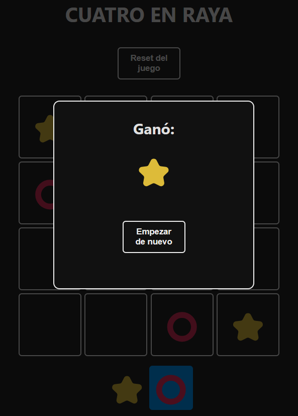

Juego cuatro en linea

Curso de React desde cero: Crea un videojuego y una aplicación para aprender useState y useEffect.

Este proyecto está basado en el tutorial de [midulive] en su canal de YouTube. El tutorial original se puede encontrar [https://www.youtube.com/watch?v=qkzcjwnueLA&t=4611s].

Vista Previa

Instalación
Asegúrate de tener Node.js y npm instalados. Luego, sigue estos pasos:

# Clona el repositorio
git clone https://github.com/Edw-Castro/cuatro-en-linea.git

# Entra al directorio del proyecto
cd cuatro-en-linea

# Instala las dependencias
npm install